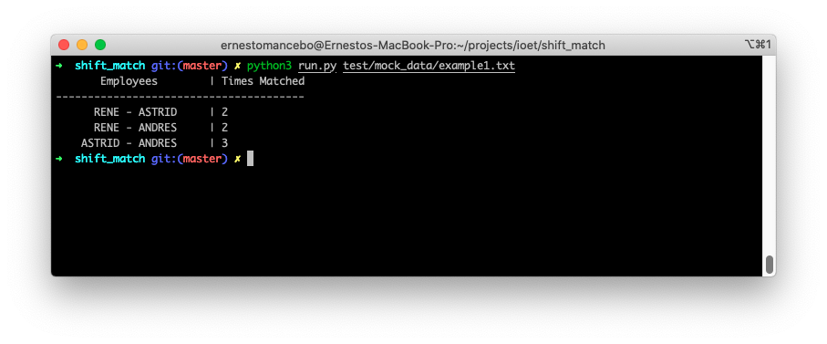

# Shift Match
[](https://circleci.com/gh/ernestomancebo/shift_match/tree/demo_ci)

This is a Python project with the goal to output a table containing pairs of employees and how often they have coincided at the office.


The idea is simple: Two employees coincide if one of them start their shift () whithin the time lapse the first employee was present (). Mathematically it is: .


## Running it

This is a vanilla Python console project, no shiny dependency was used. To run this type in the console:

```bash
$ python run.py path/to/file.txt
```

The output of this would be something like the following.




### The file

Important to note that it is the file structure. The given file must comply the following format per line: `Employee Name=DDHH:MM-HH:MM,DDHH:MM-HH:MM,...`, being: `DD` a day acronym, valid values are: `MO, TU, WE, TH, FR, SA, SU `; `HH:MM` is the time of the day in a 24H format. **IMPORTANT:** as a shift is a time range, it must be placed the clock in time first followed by the clock out. An example would be: `RENE=MO10:00-12:00,TU10:00-12:00`, and this is read: *Rene clocks in on mondays at 10 and clocks out at 12*.


## Testing the code

The project is tested with `PyTest`, meaning that you should install it, but it's quite simple; the steps are:

``` bash
$ python3 -m venv .env
$ source .env/bin/activate
$ pip install -r requirements.txt
$ python3 -m pytest
```


